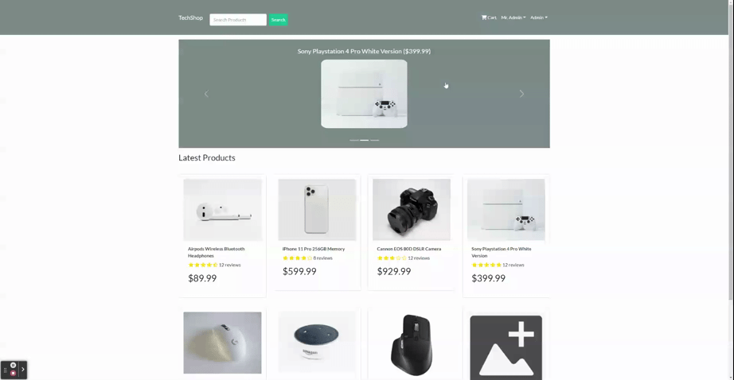
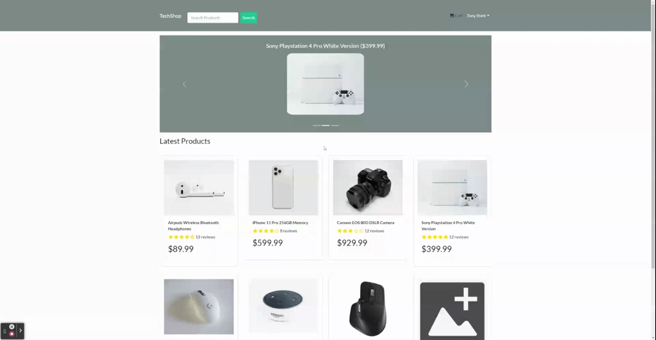
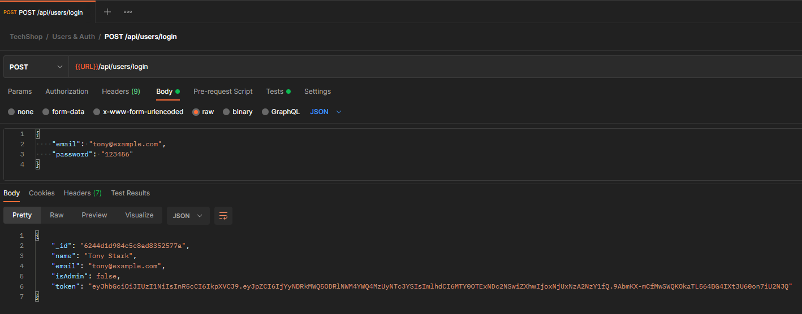
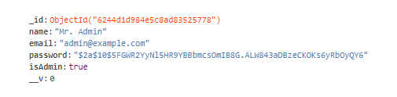
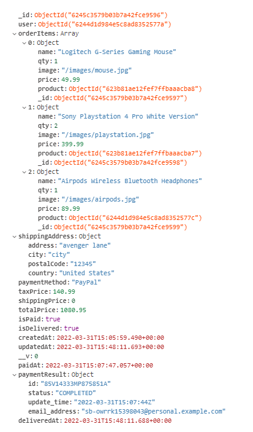
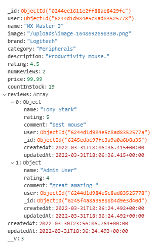

# MERN TechShop

## Description:


[TechShop](https://merntechshop.herokuapp.com) is an ecommerce website using the MERN stack and Redux for state management. TechShop allows users to browse, purchase, and review products that are stored in a MongoDB database. Admins can edit, create, delete products, view and edit orders, as well as view, create, edit, and delete users.

# Table of Contents

- [Repository](#repository)
- [Examples](#examples)
- [Usage](#usage)
- [Technologies Used](#technologies-used)
- [Questions](#questions)
- [Contributions](#contributing)
- [License](#license)

## Repository:

---

- [My Github Profile](https://github.com/Grey-Whitt)

- [This Repository](https://github.com/Grey-Whitt/mern-tech-shop)

- [Deployed Application](https://merntechshop.herokuapp.com/)

## Examples

---

### Example of the admin screens



### Example of a user going through the checkout process



### Example login route from postman



### Example of a user in the database



### Example of an order in the database



### Example of a product in the database



## Usage

---

### ES Modules in Node

Server imports handled with ECMAScript Modules. You will need node v14.6^ or higher to run this project.

### Env Variables

Create a .env file in the root with following variables

```
NODE_ENV = development
PORT = 5000
MONGODB_URI = Your MongoDB uri
JWT_SECRET = 'shhhhhh'
PAYPAL_CLIENT_ID = Your PayPal client id
```

### Install Dependencies (client & server)

```
npm install
cd client
npm install
```

### Run

```
# Run client (:3000) & server (:5000)
npm run dev

# Run backend only
npm run server
```

## Build & Deploy

```
# Create frontend production build
cd client
npm run build
```

There is a Heroku postbuild script, so if you push to Heroku, no need to build manually for deployment to Heroku.

### Seed Database

Use these scripts to seed database with example users and products

```
# Import data
npm run data:import

# Destroy data
npm run data:destroy
```

```
Sample User Logins

admin@example.com (Admin)
123456

tony@example.com (User)
123456

bruce@example.com (User)
123456
```

## Technologies Used

---

MongoDB  
Express.js  
React  
Node.js  
Redux  
JSON Web Tokens  
BCrypt  
React Router v6  
React Bootstrap v5  
PayPal  
Deployed with Heroku

## Questions

---

If you have any questions feel free to email me or find me on LinkedIn

[greywhitt@gmail.com](mailto:greywhitt@gmail.com)

[My LinkedIn](https://www.linkedin.com/in/grey-whittenberger)

## Contributing:

---

[](./uploads/CODE_OF_CONDUCT.md)

Contributions, issues and feature requests are welcome.

## License:

---


Copyright 2022 Grey Whittenberger

Permission is hereby granted, free of charge, to any person obtaining a copy of this software and associated documentation files (the "Software"), to deal in the Software without restriction, including without limitation the rights to use, copy, modify, merge, publish, distribute, sublicense, and/or sell copies of the Software, and to permit persons to whom the Software is furnished to do so, subject to the following conditions:

The above copyright notice and this permission notice shall be included in all copies or substantial portions of the Software.

THE SOFTWARE IS PROVIDED "AS IS", WITHOUT WARRANTY OF ANY KIND, EXPRESS OR IMPLIED, INCLUDING BUT NOT LIMITED TO THE WARRANTIES OF MERCHANTABILITY, FITNESS FOR A PARTICULAR PURPOSE AND NONINFRINGEMENT. IN NO EVENT SHALL THE AUTHORS OR COPYRIGHT HOLDERS BE LIABLE FOR ANY CLAIM, DAMAGES OR OTHER LIABILITY, WHETHER IN AN ACTION OF CONTRACT, TORT OR OTHERWISE, ARISING FROM, OUT OF OR IN CONNECTION WITH THE SOFTWARE OR THE USE OR OTHER DEALINGS IN THE SOFTWARE.

For more information about licenses, please visit:
[License](https://opensource.org/licenses/MIT)
